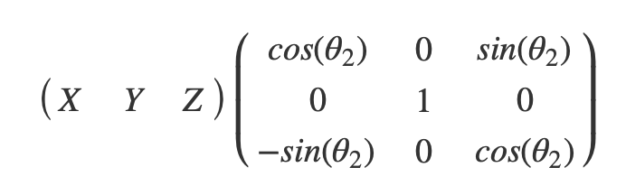

# Introduction

`$${\sqrt {n}}\left(\left({\frac {1}{n}}\sum _{i=1}^{n}X_{i}\right)-\mu \right)\ {\xrightarrow {d}}\ N\left(0,\sigma ^{2}\right)$$`

Beautiful imagery can be created by "wrapping" curves around a "donut" or a "torus". In this note, we describe how the formulas that accomplish this work.  It is useful to imagine a clock with one hand fixed to the edge of a turntable.  The clock is positioned such that the line between the center of the turntable and the center of the clock contains "9 o'clock" and the "plane containing the clock face" is perpendicular to the plane of the turntable.  The hand of a clock has a light on at the end of it.  As the turntable spins and the clock hand spins the light traces out a "curve" going around the donut. At least in principle, one could create the imaginary described here using long exposure photography with such a mechanism.  To determine where the light is at any point in time, one needs to know the position of the hand on the clock as well as the position of the clock on the turntable.  The radius of the clock, $r_1$, and the radius of the turntable, $r_2$, matter as well but this we will view as fixed over time.

Let $\theta_1(t) = t2\pi$ be the angle of the clock hand on the clock over time. Let $\theta_2(t) = \frac{tp2\pi}{q}$ be the angle of the turntable over time.  Angles are measured in radians.  When $t = 1$ the clock hand has returned to where it started. Therefore, $1$ is the amount of time it takes for the clock hand to do one full revolution.  Also, when $t = q/p$ the turntable has returned to where it started. Therefore $q/p$ is the amount of time it takes for the turntable to do one full revolution. We seek to express how the light moves through three dimensional space using an $xyz$ coordinate system that places the center of the turntable at the origin. We will treat $X$ as "left to right,"  $Y$ as "up and down"", and $Z$ as  "back and front".  Therefore, we can think of the $XY$ orthographic projection of the donut as an "elevation" and the $XZ$ orthographic projection of the donut as the "floor plan."

It is intuitive to create the function as a compound function of three functions.  The first positions the hand of the clock on the face of the clock.  The second rotates the face of the clock with the rotation of the turntable. The third positions the center of the clock on the turntable.  The first function, $f_1$ maps $\theta_1$ to $XYZ$. The second function $f_2$ maps $XYZ$ and $\theta_2$ to $XYZ$. The third maps XYZ and $\theta_2$ to $XYZ$.

The $f_1$:  $R \rightarrow R^3$ is defined as
$$ f_1( \theta_1) = [r_1sin(\theta_1), r_1cos(\theta_1), 0] $$

The $f_2$:  $R + R^3 \rightarrow R^3$ is defined as

{width=20% height=20%}

This function is using matrix multiplication to rotate the X axis towards the Z axis while keeping the Y axis fixed.
 
The $f_3$:  $R + R^3 \rightarrow R^3$ is defined as

$$ [X Y Z] + [r_2cos(\theta_2),0,r_2sin(\theta_2)] $$

With these three functions, the donut wrapping function can be defined as:

The $f_4$:  $R + R \rightarrow R^3$ is defined as


$$  f_3(f_2(f_1(\theta_1),\theta_2),\theta_2) $$

or 

$$  f_3\bigg(f_2 \bigg(f_1 \bigg( \frac{t2\pi}{q} \bigg), \frac{t2\pi}{q} \bigg), \frac {t2\pi}{p} \bigg) $$
# Proposition

If $p$ and $q$ are integers, when $t = pq$, the curve coincides with the curve when $t  = 0$.

Further whenever $t = pq + x$, it coincides with the curve when $t$= $x$ for any $x$.

#Proof

When $t = pq$, $\theta_1  = pq2\pi$ and $\theta_2 = p^2\pi$

as $p$ and $q$ are integers it is the case that 

$$cos(pq2\pi + x) = cos(p^22\pi + x) =cos(0 + x) $$
and
$$sin(p2\pi) = sin(q2\pi) = sin(0) $$
and the since The function $f_4$ only depends on $\theta_1$ and $\theta_2$ as through the $cos$ and $sin$ functions the curve must coincide:

$$  f_3(f_2(f_1(0),0),0) = f_3(f_2(f_1(p^22\pi),p^22\pi),pq2\pi)  $$

As $f_1(p2\pi) = f_1(q2\pi)$, $f_2(XYZ,p2\pi) = f_2(XYZ,q2\pi)$ ,
 $f_3(XYZ,p2\pi) = f_3(XYZ,q2\pi)$ for any integers $p$ and $q$. 

# Remarks  
1) This implies that if p/q is a rational number the curve will eventually come back to itself and forever repeat. 

2) Conversely, if p/q is not a rational number they will never coincide and the curve will go one forever. (If it did coinicide at some point in finite $t$ it would a rational number as it could be represented as the ratio of two integers).

3) If $p/q$ is a big number the turntable moves faster than the clock and the lines around the donut will be relatively flat.  If $p/q$ is a small number the clock moves fast relative to the turntable and the curves are the donut are relatively step. 

4) In $pq$ revolutions of the clock revolves the light coincides with its starting point and $p^2$ is the number of times that the turntable revolves.

5) Suppose $p/q = 3/5$.  The when $pq$ = 15 they coincide.  So that when clock goes around 15 times and the turntable goes around 9 times they will conincide.  They will also coincide when the clock goes around 5 times and the turn table goes are 3 times. Because the clock is going around 5 times, you get five inner curves that form a five point star in the center of the torus when viewed from a floor plan. See figure below.


```{r, echo = FALSE}
rm(list=ls())
NNN = 10000
r1= 1
r2= 1.7
p = 3
q = 4
theta1 = seq(0,1,length=NNN)*p*q*2*pi
theta2 = seq(0,1,length=NNN)*(p/q)*p*q*2*pi
f1 = cbind(r1*sin(theta1),r1*cos(theta1),rep(0,NNN))

#plot(f1)
f2 = f1
 for (i in 1:NNN){
  f2[i,]=f1[i,]  %*% rbind( c(sin(theta2[i]),0,cos(theta2[i])),
                        c(0,1,0),
                        c(-cos(theta2[i]),0,sin(theta2[i])) ) 
 }

donut = f2 + cbind(r2*sin(theta2),rep(0,NNN),r2*cos(theta2))

#summary(donut)
par(pty="s",ann=NA,mfrow=c(1,2),bg="grey99",mai=0.5*c(1,1,1,1))
plot(donut[,c(1,2)],xlim=c(-3,3),ylim=c(-1,1),typ="l",main="Elevation",ylab="Y",xlab="X")
plot(donut[,c(1,3)],typ="l",
     main="Floor Plan",ylab="Y",xlab="X",xlim=c(-3,3),ylim=c(-3,3))
lines(r2*sin(theta1),r2*cos(theta1),col="blue")
lines((r2+r1)*sin(theta1),(r2+r1)*cos(theta1),col="lightblue")
lines((r2-r1)*sin(theta1),(r2-r1)*cos(theta1),col="lightblue")
```


This would correspond to the turn table going around 25 times and the clock going around 15 times. 
```{r, echo=FALSE}
p = 7
q = 3
theta1 = seq(0,1,length=NNN)*p*q*2*pi
theta2 = seq(0,1,length=NNN)*(p/q)*p*q*2*pi
f1 = cbind(r1*sin(theta1),r1*cos(theta1),rep(0,NNN))

#plot(f1)
f2 = f1
 for (i in 1:NNN){
  f2[i,]=f1[i,]  %*% rbind( c(sin(theta2[i]),0,cos(theta2[i])),
                        c(0,1,0),
                        c(-cos(theta2[i]),0,sin(theta2[i])) ) 
 }

donut = f2 + cbind(r2*sin(theta2),rep(0,NNN),r2*cos(theta2))

#summary(donut)
par(pty="s",ann=NA,mfrow=c(1,2),bg="grey99",mai=0.5*c(1,1,1,1))
plot(donut[,c(1,2)],xlim=c(-3,3),ylim=c(-1,1),typ="l",main="Elevation",ylab="Y",xlab="X")
plot(donut[,c(1,3)],typ="l",
     main="Floor Plan",ylab="Y",xlab="X",xlim=c(-3,3),ylim=c(-3,3))
```

